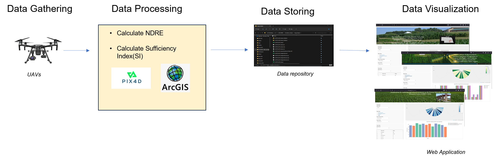
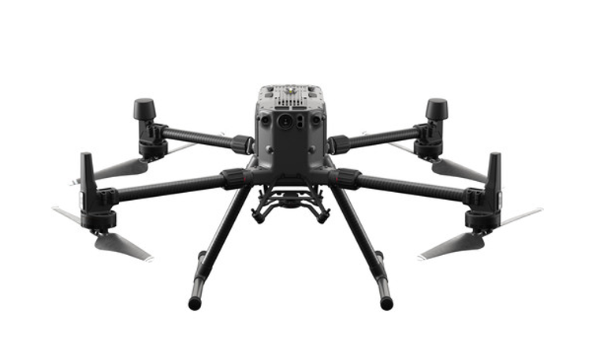
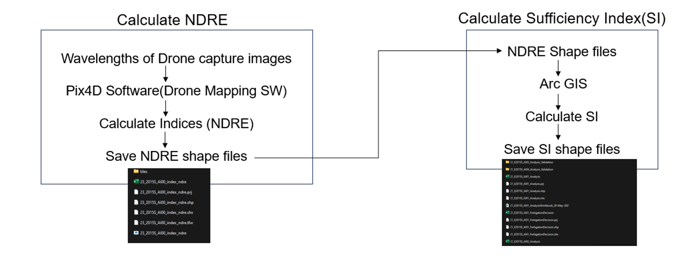
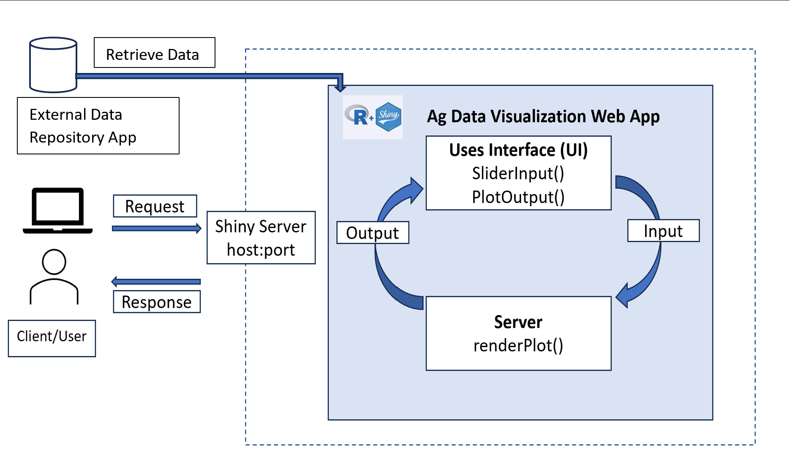
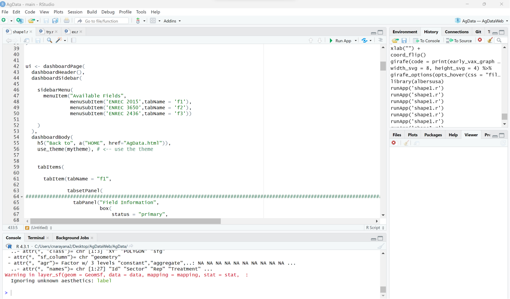
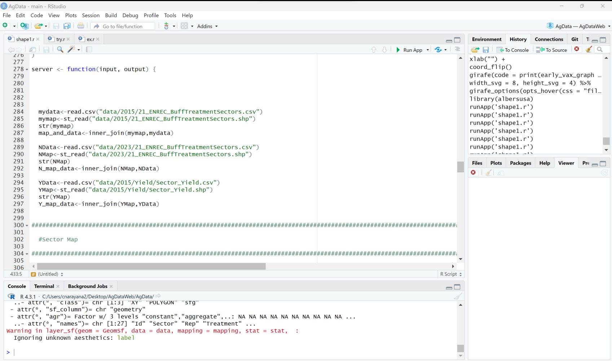
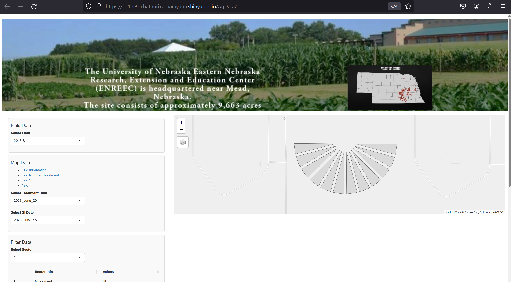
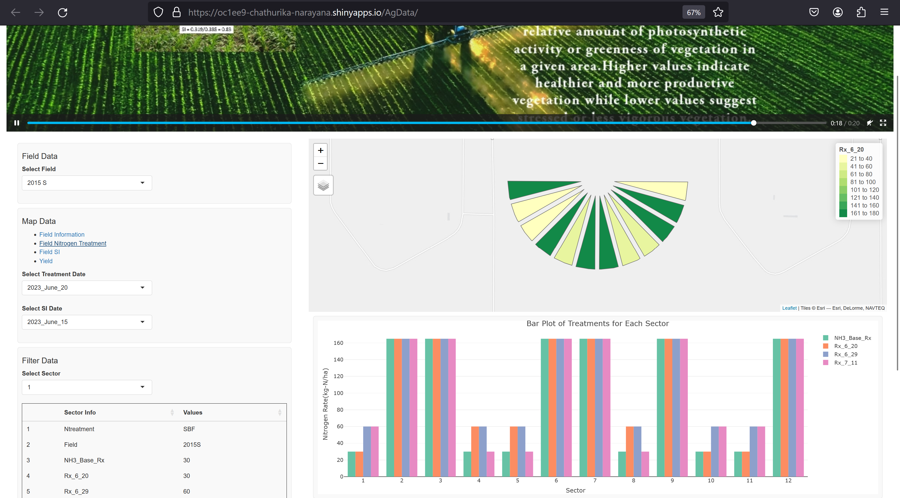
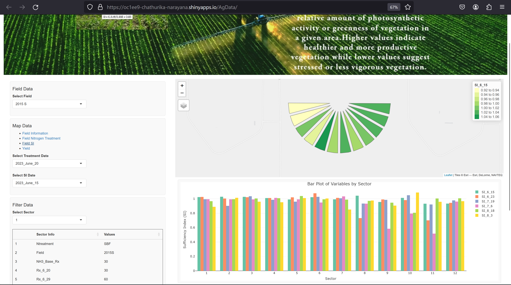
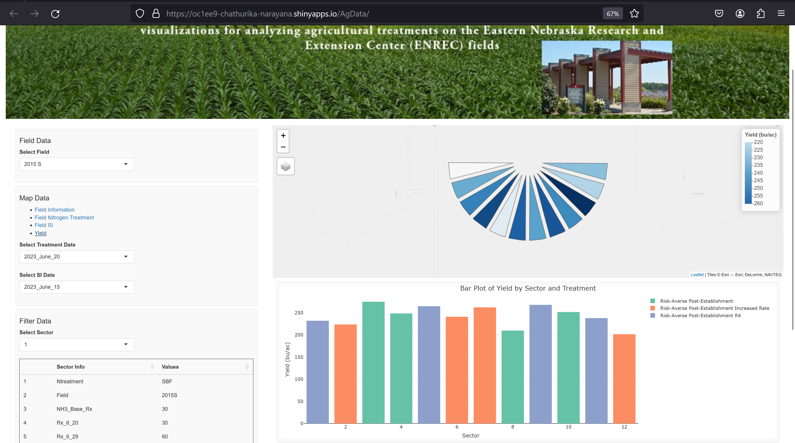

Project Report: Creating a website to Visualize Agricultural Data based on N treatments.

Student Name: Chathurika Narayana

**Folder Structure**

-   ui.r

-   Data

    -   2023
        -   21_ENREC_BuffTreatmentSectors.cpg
        -   21_ENREC_BuffTreatmentSectors.csv
        -   21_ENREC_BuffTreatmentSectors.dbf
        -   21_ENREC_BuffTreatmentSectors.prj
        -   21_ENREC_BuffTreatmentSectors.sbn
        -   21_ENREC_BuffTreatmentSectors.sbx
        -   21_ENREC_BuffTreatmentSectors.shp
        -   21_ENREC_BuffTreatmentSectors.shp.NEXEN-8M3JKN3.5320.30600.sr.lock
        -   21_ENREC_BuffTreatmentSectors.shp.xml
        -   21_ENREC_BuffTreatmentSectors.shx

-   www

    -   WebBanner.mp4

-   ui.r

In a Shiny application, the ui.R file is define the user interface (UI) components of the app. It specifies how the app looks and interacts with the user. The ui.R file typically includes various functions and components from the Shiny package to create a layout, input elements, and output elements.

-   Data

This directory contains data files. 2023: This subdirectory is specific to the year 2023. 21_ENREC_BuffTreatmentSectors.cpg: Character encoding file for the shapefile. 21_ENREC_BuffTreatmentSectors.csv: Comma-separated values file. 21_ENREC_BuffTreatmentSectors.dbf: Database file containing attribute data. 21_ENREC_BuffTreatmentSectors.prj: Projection file providing coordinate system information. 21_ENREC_BuffTreatmentSectors.sbn, 21_ENREC_BuffTreatmentSectors.sbx: Spatial index files. 21_ENREC_BuffTreatmentSectors.shp: Main shapefile containing geometric data. 21_ENREC_BuffTreatmentSectors.shp.NEXEN-8M3JKN3.5320.30600.sr.lock: Lock file related to spatial reference. 21_ENREC_BuffTreatmentSectors.shp.xml: Metadata file for the shapefile. 21_ENREC_BuffTreatmentSectors.shx: Shape index format file.

-   www

This directory is often used to store static files, such as images, videos, etc., that can be accessed by the Shiny app. WebBanner.mp4: A video file named "WebBanner.mp4" that can be used in your Shiny app.

**Used Libraries**

shiny

shinydashboard

leaflet

sf

dplyr

ggplot2

tmap

DT

tidyverse

tidyr

mapview

tmaptools

plotly

**Shiny App Development Document**

<https://shiny.posit.co/r/articles/share/deployment-web/>

<https://shiny.posit.co/r/deploy.html>

1.  Introduction

Welcome to the "Ag Data Visualization" web application, a tool designed to provide insightful visualizations for analyzing agricultural treatments on the Eastern Nebraska Research and Extension Center-ENREC fields (ENREC). The application leverages cutting-edge technology to deliver comprehensive visual representations of N (Nitrogen) treatments, cultivated through an innovative process that involves UAV (Unmanned Aerial Vehicle) imagery and advanced geospatial analysis. These N treatments are created using shape files extracted from high-resolution UAV images, ensuring precision in delineating treatment areas and crop variations across the field.

One of the central analytical tools within the application is the Sufficiency Index, a metric that provides valuable insights into the effectiveness of N treatments (Rehman_et_al ,2022). This index allows users to evaluate the sufficiency of nitrogen in various treatment zones, guiding decisions related to optimal resource allocation and nutrient management. The Sufficiency Index, combined with the spatial visualization of treatments, empowers farmers, agronomists, and researchers with a comprehensive understanding of the field's dynamics.

Beyond treatment analysis, the application takes a step further by visualizing yield data in an intuitive and informative manner. Yield information is seamlessly integrated into the interactive geospatial interface, enabling users to spot patterns, trends, and anomalies across different treatment areas. The "Ag Data Visualization" web application represents a convergence of agriculture, technology, and data science, catering to the needs of modern agriculture. With a user-friendly interface, advanced analytical capabilities, and visually engaging representations, the "Ag Data Visualization" web application is a gateway to data-driven insights for a thriving agricultural future.

2.  Problem Statement

Modern agriculture is becoming increasingly data-intensive, with excessive information generated from various sources such as sensors, satellites, and imaging technologies. This influx of data offers an opportunity to optimize farming practices, enhance crop yield, and make informed decisions. However, the complexity of agricultural data and the need for efficient analysis pose significant challenges to agronomists and field newcomers. One of the primary challenges lies in analyzing agricultural treatments, such as Nitrogen (N) applications, on fields like those at the Eastern Nebraska Research and Extension Center (ENREC).

This accurate analysis of treatment effects with a comprehensive understanding of spatial variations, crop health, and yield outcomes. Moreover, the specialized knowledge and technical skills required for in-depth data analysis create a barrier for many agricultural professionals who may need a data science or geospatial analysis background. As a result, there is a growing need for accessible and user-friendly data analysis tools that bridge the gap between complex data and actionable insights. The "Ag Data Visualization" web application addresses this challenge by offering a simplified solution for visualizing and analyzing N treatments and their impact on ENREC fields.

The application's user-friendly interface empowers many stakeholders, from farmers and agronomists to researchers, to effortlessly interact with and interpret complex agricultural data. By providing a platform that seamlessly integrates UAV imagery-derived shape files, advanced geospatial analysis, and metrics like the Sufficiency Index, the application equips users with the means to explore treatment effects comprehensively. The intuitive interface enables users to effortlessly compare different treatments, spot trends, and make informed decisions that can optimize resource allocation and improve crop yield.

3.  Data Flow

Figure 1 shows the Data Flow of the Ag Data Application from the very first step to the end.

**Data Gathering**

In the dynamic landscape of modern agriculture, the utilization of UAVs (Unmanned Aerial Vehicles) has emerged as a game-changer in data gathering. These versatile flying platforms, commonly known as drones, offer an innovative and efficient means of capturing rich and actionable agricultural data for the Ag Data Visualization web application. Using DJI Matrice 300 Series (Figure 2), UAV is equipped with a multispectral camera to capture Red (R) and Near-Infrared (NIR) bands (enterprise. dji).

**Data Processing**

Converting this data into a shapefile format involves a multi-step process. It's important to note that capturing spectral bands directly as a shapefile is not standard practice; instead, the collected data is usually processed, analyzed, and then represented in a shapefile format for visualization and analysis. For that used Pix4D software (The Pix 4D). Here's the overview of the process:

• UAV Imagery Collection: Fly the UAV equipped with the multispectral camera over the field of interest and simultaneously capture images in the Red and NIR bands. • Image Preprocessing: Radiometrically calibrates the images to ensure consistent and accurate reflectance values and georeferenced the images using GPS data to align them with absolute coordinates. • Spectral Data Extraction: For each pixel in the captured images, extract the Red and NIR band reflectance values.

The NDRE and SI calculation was done using pix4d and Arc GIS software (Figure 3).

• NDRE Calculation: The calculated NDRE values represent the plant's health and chlorophyll content. Higher NDRE values usually indicate healthier vegetation with higher chlorophyll content. This information can be used to assess crop stress, nutrient deficiencies, and overall plant vigor. NDRE is calculated using the formula: NDRE = (NIR - RE) / (NIR + RE) NIR: Near-Infrared band reflectance RE: Red Edge band reflectance And save NDRE shape files into a shared folder.

• Sufficiency Index (SI) Calculation: The crop N sufficiency is measured by Sufficiency Index (SI). The SI is a measure of vegetation health or vigor derived from vegetation indices. It indicates the relative amount of photosynthetic activity or greenness of vegetation in each area. Higher values indicate healthier and more productive vegetation, while lower values suggest stressed or less vigorous vegetation (Stansell, J. S.,2021).

SI is calculated using the formula: SI= (Field NDRE) / (Reference NDRE) And save SI shape files into the shared folder.

**Data Visualization**

Using R shiny software, developed the web application to visualize the collected shape files with interactive plots.

4.  The Software Framework: R Shiny

**Introduction and Advantages**

To develop the Ag Data Visualization web application, here used R shiny software framework. The Shiny is an R package that allows to create interactive web applications. It provides highly effective data reports and visualization where users can explore the data set (R shiny).

R Shiny for developing data visualization applications offers several advantages, particularly when creating interactive and user-friendly tools for analyzing agricultural data. R Shiny seamlessly integrates with R, a powerful statistical programming language widely used in data analysis and visualization. It enables the creation of dynamic and interactive visualizations. Developers can build responsive plots, maps, graphs, and charts that allow users to interact with data, change parameters, and explore different scenarios.

R Shiny makes it easy to design user-friendly interfaces without extensive web development knowledge. And provides flexibility in designing layouts, allowing us to arrange plots, maps, tables, and other components to suit the application's requirements. Shiny offers a variety of packages that help to create interactive widgets, such as sliders, dropdowns, checkboxes, and text inputs. These widgets enhance user engagement by enabling them to adjust parameters and customize views.

R Shiny provides benefits from a solid and active community. Developers can find ample tutorials, documentation, and examples online to assist in the development journey.

For agricultural applications, where visualizing and analyzing complex data is paramount, R Shiny provides a practical and efficient platform to create impactful and accessible tools. Its integration with R's analytical capabilities makes it a valuable choice for creating user-friendly and interactive data visualization applications tailored to the agricultural sector's needs.

5.  Design and Development of the Ag Data Visualization Website System Architecture

Ag Data Visualization Web Application system architecture is shown in Figure 4.

Using R shiny software, developed the web application to visualize the collected shape files with interactive plots.

The application has two layers that build using R studio

• User Interface (UI)- ui.r

This is the place where any user interacts with the web application. It manages the arrangement and visual design of the application (Figure 5). The UI is responsible for managing the content showcased on the application interface and determining the arrangement of its various elements. This encompasses text, markdown elements, images, interactive user input widgets, and visual representations like plots.

• The server- server.r

The server function contains the instructions needed to build the application. This functions as the backend responsible for processing these input values, generating the eventual output outcomes visible on the website. The information destined for display via the UI falls within the server (Figure 6).

• External Data Repository App

Currently, the application retrieves data from a folder within the application itself. However, in the future, the web application's data will be sourced from an external repository using an API key.

The application runs/debugs on the shiny server and provides the output in the browser as the client request.

**Ag Data Visualization UI Design**

Ag Data Visualization web application developed to visualize the nitrogen treatment information in ENREC fields.

• Field Information

The DATA UI is structured into 4 menues, and the first one shows the field information (Figure 7). In the left corner, the drop down shows the field names (2015,field2,field3). Here in the present, development has been completed only for the 2015 field. The page shows the information related to the field 2015.

• Field Nitrogen Treatment

Here contains N treatment data (Figure 8). The sector map shows the Target amount of N and Applied N rates on the field. Users can select Treatment Date. The sector map shows twelve sectors that have different N treatment rates using a color bar. And the bottom of the page displays the bar plot for N treatment data for each sector. All the information can be displayed sector-wise over the mouse pointer in both plots.

• Field SI Data

The sector-wise SI data is displayed under this tab, and all the information shows over the mouse pointer (Figure 9). And users can select the dates under the select date menu as their preference to see the SI changes on the field on a particular date. The bar plot shows the SI data for each sector on the presented dates.

• Yield Data

The Yield information tab page displays the yield information in each sector.

6.  Results and Impact

The ag data visualization website's interactive visualizations play a pivotal role in facilitating decision-making and analysis.

• Crop Health Assessment

Here aims to assess the health of the crops across multiple fields to make informed decisions about nutrient application. By uploading UAV imagery data captured from the fields, including Red (R) and Near-Infrared (NIR) bands, use the NDRE calculation feature to generate SI maps that highlight areas of varying crop health. This allows us to pinpoint zones with low SI values, indicating potential stress or nutrient deficiencies. With that information can adjust the nutrient application and pest control strategies according to the specific needs of each treatment zone. This led to improved crop health and optimized resource utilization.

• Yield Analysis and Prediction

Here aims to analyze historical yield data and predict future yields to optimize planting and harvesting schedules. While integrating the historical yield datasets into the ag data visualization website using interactive charts and graphs can visualize yield trends over multiple seasons. Armed with predictive insights, it can create planting and harvesting schedules to maximize yield potential while minimizing risk.

7.  Conclusion

By harnessing the power of R Shiny, develop a user-friendly interface that empowers users to visualize, analyze, and treat their agricultural data with unprecedented precision.

Key Outcomes and Accomplishments:

This platform enables users to explore complex agricultural datasets using interactive visualizations. The ability to dynamically adjust parameters, zoom into specific time periods, and customize views has transformed data exploration into a seamless and insightful experience. Users can make data-driven decisions with confidence. The interactive nature allows users to identify trends, correlations leading to optimized crop management strategies and resource allocation. By segmenting fields into treatment zones based on calculated indices such as NDRE, SI users can allocate resources more efficiently. This targeted approach enhances crop health while minimizing the wastage of valuable resources. R Shiny has allowed us to create an intuitive and user-friendly interface, eliminating the need for extensive programming knowledge. This inclusivity ensures that individuals from various backgrounds can harness the power of data analysis.

8.  Future Extensions and Enhancements

The application is still under development and enhance the application by hosting the application on the university premises. Add different data sources including planet lab, John Deer data, UAV imageries. Add data layer to the system architecture as in data repository. Application visualization completed with several field and added more input field information other than N treatment. Add more interactive plots and charts to make it easy with user access. Add reporting function and upload download data facility.

9.  References

• <https://extension.unl.edu/statewide/enreec/>. (n.d.). Institute of Agriculture and Natural Resources EASTERN NEBRASKA RESEARCH, EXTENSION AND EDUCATION CENTER.

• Rehman, T. H., Lundy, M. E., & Linquist, B. A. (2022). Comparative Sensitivity of Vegetation Indices Measured via Proximal and Aerial Sensors for Assessing N Status and Predicting Grain Yield in Rice Cropping Systems. Remote Sensing, 14(12). <https://doi.org/10.3390/rs14122770>

• <https://enterprise.dji.com/matrice-300>. (n.d.). enterprise.dji.

• <https://www.pix4d.com/industry/surveying-mapping/>. (n.d.). The Pix 4D.

• Stansell, J. S. (2021). DEVELOPMENT AND AUTOMATION OF A SENSOR-BASED FERTIGATION MANAGEMENT FRAMEWORK FOR IMPROVED NITROGEN USE EFFICIENCY AND PROFITABILITY IN IRRIGATED ROW CROP PRODUCTION SYSTEMS.

• <https://shiny.posit.co/>. (n.d.). R shiny.
